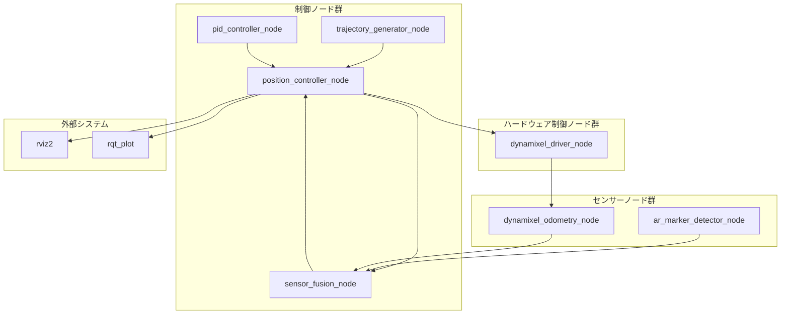

# **ラック＆ピニオン制御システム仕様書**

## **1\. 概要**

本システムは、ARマーカーによる絶対位置測定と、サーボモーターのオドメトリ（内部的な移動量計算）をセンサーフュージョン技術によって統合し、ラック＆ピニオン機構を高精度に位置決め制御することを目的とする。

本仕様書は、その実現に必要となるシステム構成、センサーモデル、および制御アルゴリズムの基本設計を定義する。対象となる技術要素は以下の通りである。

* PIDフィードバック制御  
* フィードフォワード制御  
* センサーの誤差モデル（ノイズおよびドリフト）  
* 相補フィルターによるセンサーフュージョン

## **2\. システム構成**

システムは、物理的な**制御対象**と、それを制御する**コントローラー**から構成される。

graph TD  
    subgraph コントローラー  
        A\[目標軌道生成\] \--\> B{制御演算};  
        D\[センサーフュージョン\] \--\> B;  
    end

    subgraph 制御対象  
        C\[モーター & ラックピニオン\]  
    end  
      
    subgraph センサー  
        E\[ARマーカー (絶対位置)\]  
        F\[モーターオドメトリ (相対変位)\]  
    end

    B \--\>|速度指令 v\_cmd| C;  
    C \--物理的な動き--\> E;  
    C \--物理的な動き--\> F;  
    E \--測定位置 (ノイズあり)| D;  
    F \--計算上の移動量 (ドリフトあり)| D;

* **コントローラー**: 目標値と、センサーフュージョンによって得られた「推定位置」の差（偏差）に基づき、モーターへの速度指令値を計算する。  
* **制御対象**: コントローラーからの速度指令を受け、実際にラック＆ピニオンを駆動する。  
* **センサー**: 制御対象の状態を観測する。本システムでは、特性の異なる2つのセンサーをモデル化している。

## **3\. センサーモデル**

### **3.1. ARマーカー（絶対位置センサー）**

* **役割**: グローバル座標系における絶対的な位置を測定する。これにより、オドメトリの累積誤差（ドリフト）を補正する基準となる。  
* **誤差モデル**: **ランダムノイズ**が付加されることを想定する。これは、照明の変化、カメラの解像度限界、画像処理上の誤差などによる、測定値の瞬間的なバラつきに起因する。

### **3.2. モーターオドメトリ（相対変位センサー）**

* **役割**: モーターのエンコーダー等から得られる回転量に基づき、短時間の移動量を高速かつ滑らかに計算する。  
* **誤差モデル**: **加算的なドリフトバイアス**が乗ることを想定する。これは、タイヤのスリップ、ギアのバックラッシ、路面状況の変化などにより、速度の測定に常に一定の誤差（バイアス）が乗り、時間と共に位置の誤差が累積していく現象に起因する。

## **4\. 制御アルゴリズム**

### **4.1. フィードバック制御 (PID制御)**

システムの基本的な制御ループ。目標位置と現在の推定位置との偏差 e を無くすように動作する。

vfeedback​=Kp​⋅e+Ki​∫edt+Kd​dtde​

* **P (比例)項**: 偏差に比例した操作量を生成し、迅速に目標に近づける。  
* **I (積分)項**: 定常的な偏差を解消し、最終的に目標位置にぴったり合わせる。  
* **D (微分)項**: 動きの急な変化を抑制し、振動（ハンチング）や行き過ぎ（オーバーシュート）を防ぐ。

### **4.2. フィードフォワード制御**

「軌道追従制御」において、目標軌道が要求する速度 v\_target を、あらかじめ速度指令に加えることで、フィードバック制御の遅れを補い、追従性能を向上させる。

### **4.3. 最終的な速度指令**

最終的な速度指令値 v\_command は、フィードバック制御量とフィードフォワード制御量の和として計算される。

vcommand​=vfeedback​+vfeedforward​

## **5\. センサーフュージョン（相補フィルター）**

特性の異なる2つのセンサー情報を統合し、より正確で安定した「推定位置」を得るために使用する。

### **5.1. 基本原理**

* **高周波成分（素早い動き）**: ノイズは少ないがドリフトする**オドメトリ**を信用する。  
* **低周波成分（ゆっくりとしたズレ）**: ドリフトはしないがノイズが多い**ARマーカー**を信用する。

### **5.2. 実装式**

1. 予測: オドメトリ（ドリフトバイアスを含む）から、次の時刻の位置を予測する。  
   予測位置 \= 前回の推定位置 \+ (指令速度 \+ ドリフトバイアス) × dt  
2. 補正: ARマーカーの測定値を使って、予測した位置を補正する。  
   今回の推定位置 \= α × (予測位置) \+ (1 \- α) × (ARマーカー測定位置)

### **5.3. α（アルファ）値の役割**

αは0.8〜1.0の間の係数で、どちらのセンサーをどのくらい信用するかを決定する調整パラメータである。

* **α → 1.0**: オドメトリを強く信用する。ノイズ除去効果は高いが、ドリフト補正が遅くなる。ドリフトが大きいと、推定位置が真値からズレていく。  
* **α → 0.8**: ARマーカーを強く信用する。ドリフトは素早く補正されるが、ARマーカーのノイズの影響を受けやすくなり、推定位置が振動しやすくなる。

このα値は、実機の動作を確認しながら、システムの要求仕様（応答性、安定性、精度など）に応じて最適なバランス点に調整する必要がある。

## **6\. ROS2ノード構成**

### **6.1. ノード構成図**



### **6.2. ノード詳細仕様**

#### **6.2.1. position_controller_node（メイン制御ノード）**

* **役割**: システム全体の制御を統括するメインノード
* **機能**:
  - センサーフュージョン結果の受信
  - 目標位置と推定位置の偏差計算
  - PID制御器への指令値送信
  - 最終的な速度指令値の生成と送信
* **トピック**:
  - 入力: `/estimated_position` (std_msgs/msg/Float64)
  - 入力: `/target_position` (std_msgs/msg/Float64)
  - 出力: `/velocity_command` (std_msgs/msg/Float64)
  - 出力: `/control_status` (std_msgs/msg/String)

#### **6.2.2. sensor_fusion_node（センサーフュージョンノード）**

* **役割**: ARマーカーとオドメトリの相補フィルター処理
* **機能**:
  - ARマーカー位置情報の受信
  - オドメトリ情報の受信
  - 相補フィルターによる位置推定
  - 推定位置の出力
* **トピック**:
  - 入力: `/ar_marker_position` (std_msgs/msg/Float64)
  - 入力: `/odometry_position` (std_msgs/msg/Float64)
  - 出力: `/estimated_position` (std_msgs/msg/Float64)
* **パラメータ**:
  - `alpha`: 相補フィルター係数 (0.8-1.0)
  - `drift_bias`: オドメトリドリフトバイアス (m/s)

#### **6.2.3. pid_controller_node（PID制御ノード）**

* **役割**: PID制御演算の実行
* **機能**:
  - 位置偏差の受信
  - PID制御演算
  - 制御量の出力
* **トピック**:
  - 入力: `/position_error` (std_msgs/msg/Float64)
  - 出力: `/pid_output` (std_msgs/msg/Float64)
* **パラメータ**:
  - `Kp`: 比例ゲイン
  - `Ki`: 積分ゲイン
  - `Kd`: 微分ゲイン

#### **6.2.4. trajectory_generator_node（軌道生成ノード）**

* **役割**: 目標軌道の生成
* **機能**:
  - 目標位置の設定
  - 軌道生成（直線補間、スプライン補間等）
  - フィードフォワード速度の計算
* **トピック**:
  - 出力: `/target_position` (std_msgs/msg/Float64)
  - 出力: `/feedforward_velocity` (std_msgs/msg/Float64)
* **パラメータ**:
  - `target_position`: 目標位置 (m)
  - `max_velocity`: 最大速度 (m/s)
  - `acceleration`: 加速度 (m/s²)

#### **6.2.5. ar_marker_detector_node（ARマーカー検出ノード）**

* **役割**: ARマーカーの検出と位置測定
* **機能**:
  - カメラ画像からのARマーカー検出
  - スライダ軸方向の位置計算
  - ノイズフィルタリング
* **トピック**:
  - 入力: `/camera/image_raw` (sensor_msgs/msg/Image)
  - 出力: `/ar_marker_position` (std_msgs/msg/Float64)

#### **6.2.6. dynamixel_odometry_node（オドメトリノード）**

* **役割**: Dynamixelモーターのオドメトリ計算
* **機能**:
  - エンコーダー値の読み取り
  - スライダ軸方向の位置・速度の計算
  - ドリフト補正
* **トピック**:
  - 出力: `/odometry_position` (std_msgs/msg/Float64)
  - 出力: `/odometry_velocity` (std_msgs/msg/Float64)
* **パラメータ**:
  - `rack_pitch`: ラックピッチ (m/rev)
  - `gear_ratio`: ギア比
  - `encoder_resolution`: エンコーダー分解能

#### **6.2.7. dynamixel_driver_node（モータードライバーノード）**

* **役割**: Dynamixelモーターの直接制御
* **機能**:
  - 速度指令値の受信
  - モーター制御
  - エンコーダー値の読み取り
* **トピック**:
  - 入力: `/velocity_command` (std_msgs/msg/Float64)
  - 出力: `/motor_status` (std_msgs/msg/String)

### **6.3. パラメータ設定**

#### **6.3.1. 制御パラメータ**

```yaml
# position_controller_node
control_frequency: 100.0  # Hz

# pid_controller_node
Kp: 1.0
Ki: 0.1
Kd: 0.05

# sensor_fusion_node
alpha: 0.9
drift_bias: 0.001  # m/s

# trajectory_generator_node
max_velocity: 0.1  # m/s
acceleration: 0.05  # m/s²
```

#### **6.3.2. ハードウェアパラメータ**

```yaml
# dynamixel_driver_node
motor_id: 1
baud_rate: 57600
port_name: "/dev/ttyUSB0"

# dynamixel_odometry_node
rack_pitch: 0.005  # m/rev (5mm/rev)
gear_ratio: 100.0
encoder_resolution: 4096
```

### **6.4. 起動順序**

1. **ハードウェア制御ノード群**の起動
   - `dynamixel_driver_node`
   - `dynamixel_odometry_node`

2. **センサーノード群**の起動
   - `ar_marker_detector_node`

3. **制御ノード群**の起動
   - `sensor_fusion_node`
   - `pid_controller_node`
   - `trajectory_generator_node`
   - `position_controller_node`

### **6.5. デバッグ・可視化**

* **RViz2**: スライダ位置の可視化（1次元表示）
* **rqt_plot**: 制御量、偏差、速度の時系列グラフ表示
* **rqt_console**: ログメッセージの表示
* **rqt_graph**: ノード間のトピック接続状況の確認