# フライトログに基づく壁効果の定量解析

**閉ループ姿勢制御下での壁効果検出と機体構成間比較**

 

PX4 STABILIZED モード / ULog 解析 / 15 フライト / 2 グループ比較

---

## 実験セットアップ

- ベンチ固定 + **PX4 姿勢制御ループ動作** (STABILIZED モード)
- MAVLink スクリプトで **4 フェーズを自動実行**
- ULog から姿勢・角速度・トルク指令・モータ出力を抽出

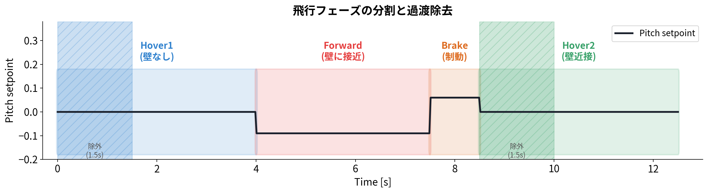

---

## データセット: 2 グループの分類

制御コマンドのトリム条件から、異なる機体構成に対応する 2 グループを同定:

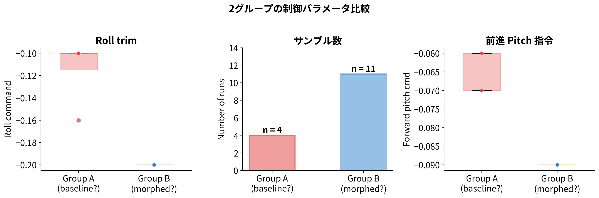

トリム値の違いは機体変形に伴う空力バイアス補正。Group A/B の構成対応は推定。

---

## Group B 代表ラン: タイムライン

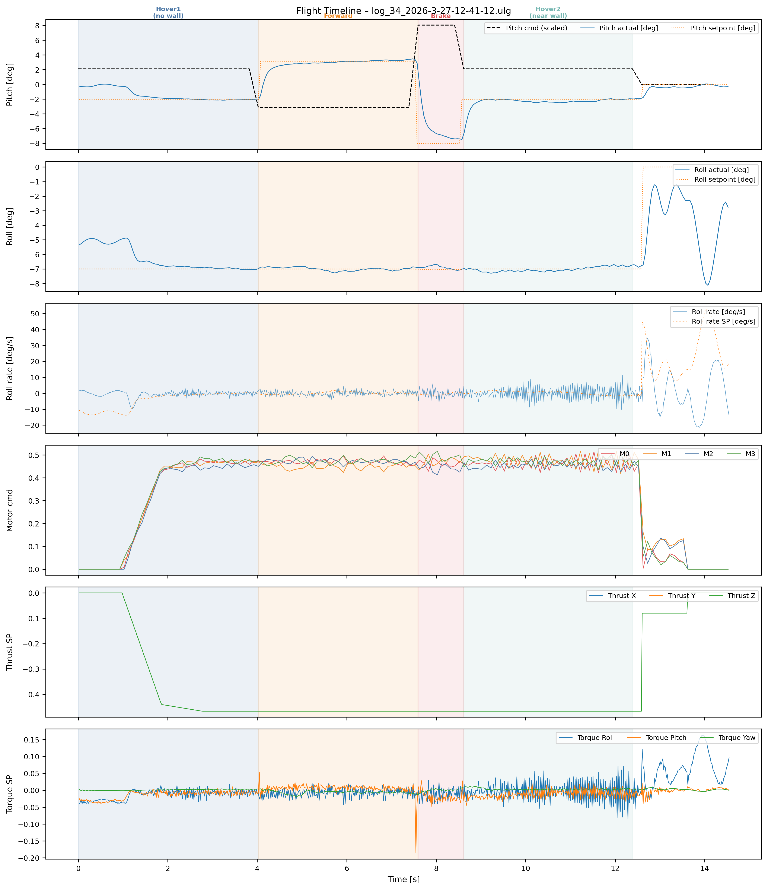

---

## Group A 代表ラン: タイムライン

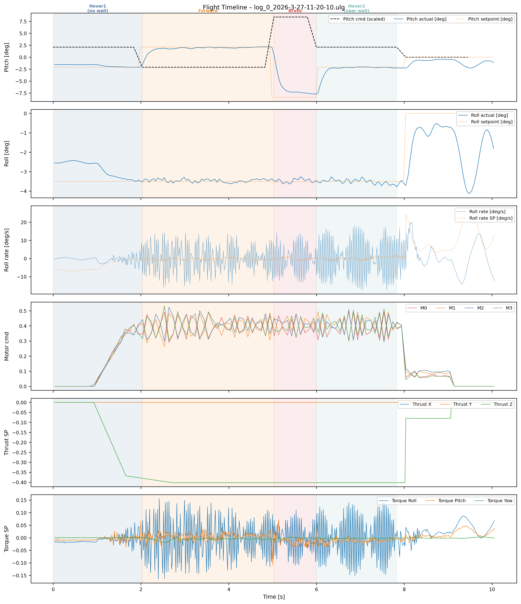

---

## Roll 外乱の詳細比較 (Group B)

Hover1 (壁なし) vs Hover2 (壁近接) — 安定区間のみ

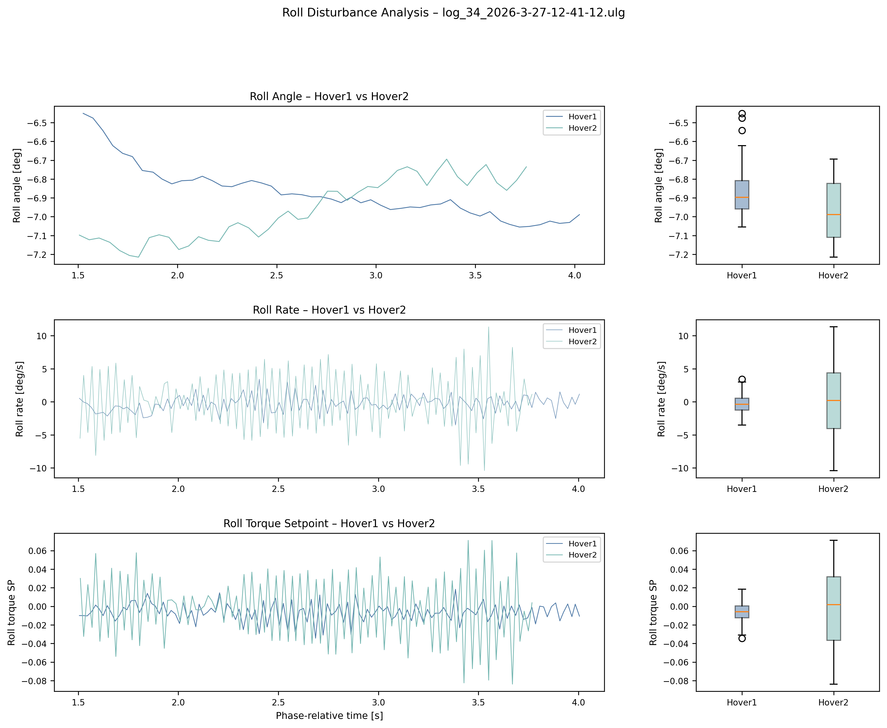

---

## Roll 外乱の詳細比較 (Group A)

Group A では Hover2 の Roll Rate 変動が Group B より顕著に大きい

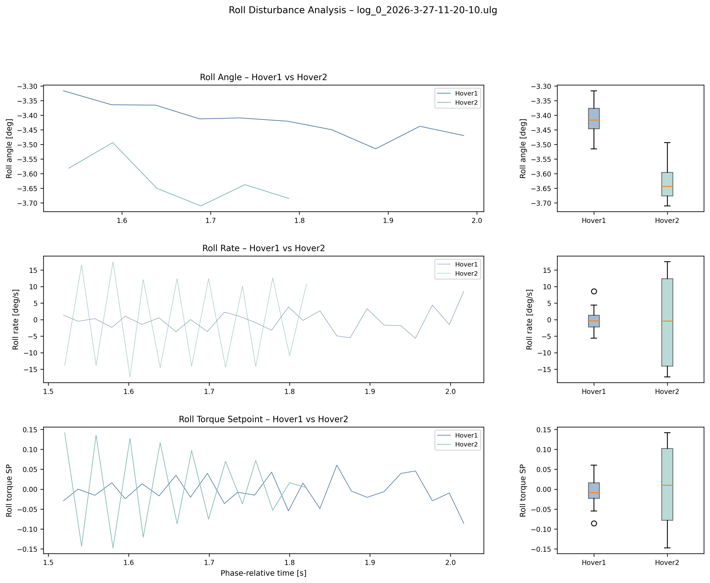

---

## モータ出力解析 (Group B)

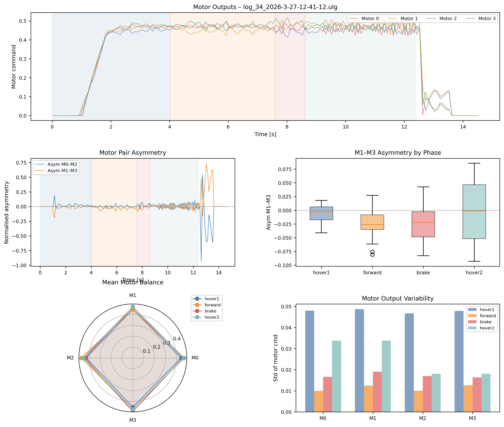

---

## 周波数解析: PSD (Group B)

Hover2 では低周波域 (<20 Hz) で Roll ジャイロの PSD が増大

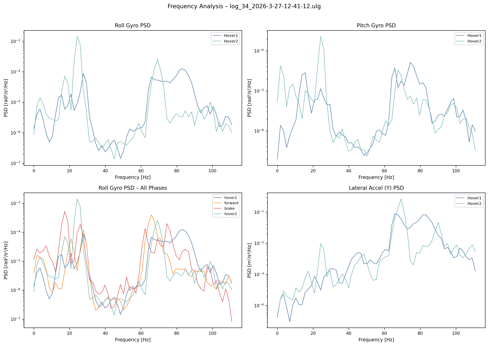

---

## 制御努力の解析 (Group B)

Hover2 では Roll トルク RMS が Hover1 より増大 → 壁効果の補償に追加の制御努力

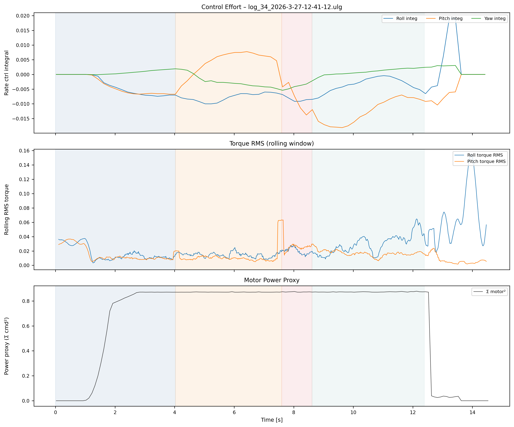

---

## 過渡除去の効果 (Group B)

ホバリング先頭 1.5 s を除去 → **3 指標が新たに有意に**

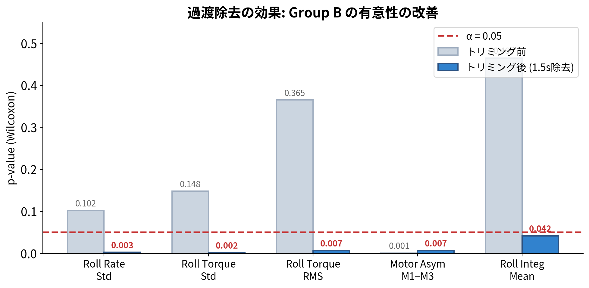

---

## 壁効果の検出: Group B 統計 (n=11)

Hover1 → Hover2 で制御応答が有意に変化:

| 指標 | Hover1 | Hover2 | 倍率 | Cohen's d | p 値 |
|---|---|---|---|---|---|
| Roll Rate Std [deg/s] | 1.29 | 3.68 | **×2.9** | 1.53 | **0.003** |
| Roll Torque Std | 0.010 | 0.029 | **×2.9** | 1.37 | **0.002** |
| Roll Torque RMS | 0.013 | 0.031 | **×2.4** | 1.41 | **0.007** |
| Motor Asym M1−M3 | −0.003 | +0.005 | **反転** | 0.81 | **0.007** |
| Roll Integ Mean | −0.005 | −0.003 | — | 0.37 | **0.042** |

→ 6 軸力センサなしで **制御ログのみから壁効果を定量検出**

---

## 複数ラン統計: Group B (n=11)

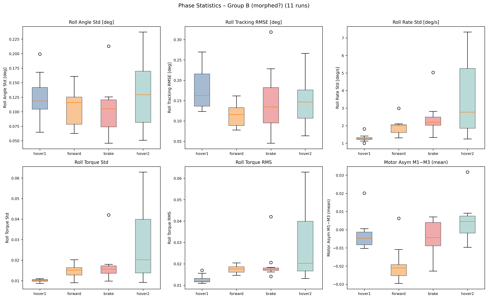

---

## 複数ラン統計: Group A (n=4)

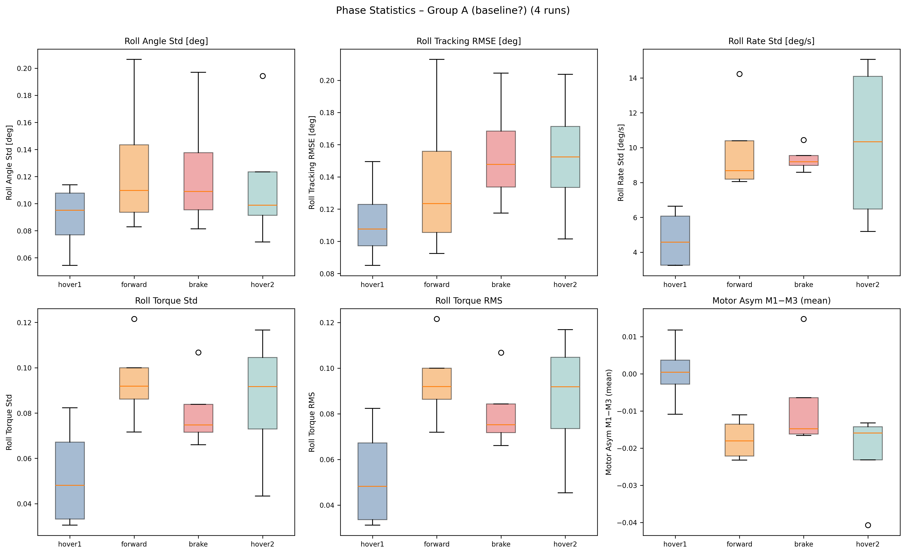

---

## グループ間比較

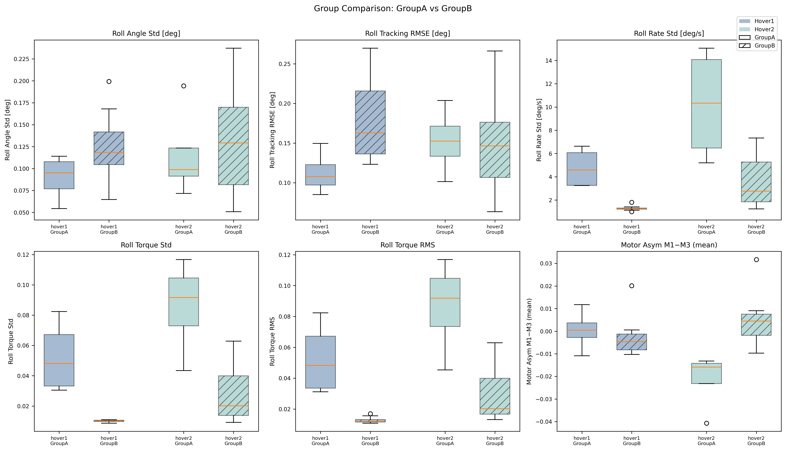

---

## 全指標: Hover1 vs Hover2 × Group A / B

6 指標すべてを並列比較（* p<0.05, ** p<0.01, *** p<0.001）

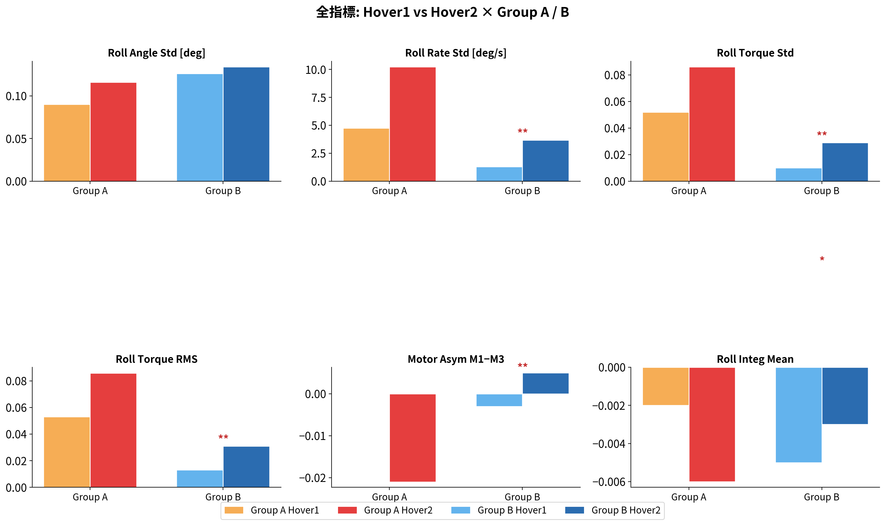

---

## 主要指標のまとめ（抜粋 3 指標）

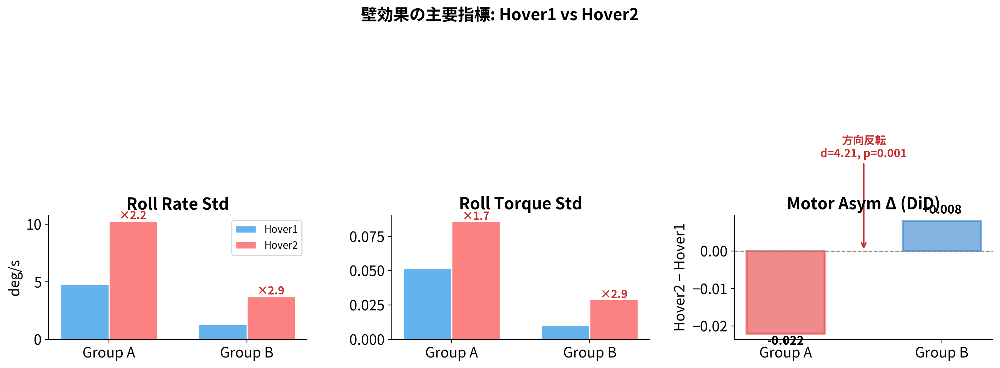

---

## Difference-in-Differences (DiD) 分析

トリムバイアスを除去し、**壁効果そのものの大きさ** をグループ間で比較:

$$\Delta_i = \text{metric}(\text{Hover2}) - \text{metric}(\text{Hover1})$$

| 指標 | Group A Δ | Group B Δ | Cohen's d | p 値 |
|---|---|---|---|---|
| Motor Asym M1−M3 | **−0.022** | **+0.008** | **4.21** | **0.001** |
| Roll Integ Mean | −0.004 | +0.002 | **2.37** | **0.001** |
| Roll Rate Std | +5.48 | +2.40 | −0.78 | 0.280 |
| Roll Torque Std | +0.034 | +0.019 | −0.56 | 0.343 |
| Roll Torque RMS | +0.034 | +0.018 | −0.61 | 0.343 |
| Roll Angle Std | +0.026 | +0.008 | −0.32 | 1.000 |

---

## DiD 全 6 指標のプロット

有意 / 非有意を含む全指標の壁効果 Δ を可視化

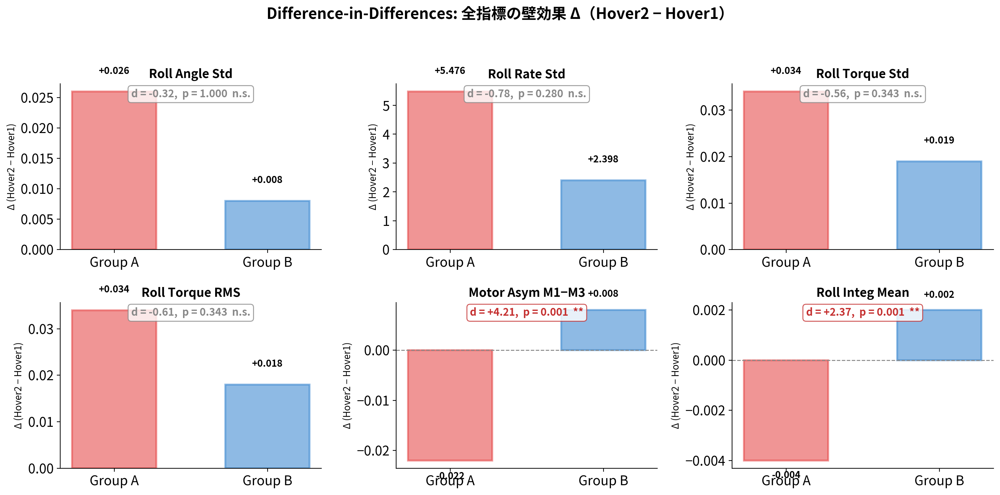

---

## DiD 分析の解釈

### 有意な指標 (p < 0.05)
- **Motor Asym M1−M3** (d=4.21, p=0.001)
  壁効果の**方向が反転** — 最も顕著な発見
- **Roll Integ Mean** (d=2.37, p=0.001)
  定常外乱補償の**蓄積方向が反転**

### 有意でないが傾向のある指標
- **Roll Rate Std** (d=−0.78, p=0.280)
  Group A の壁効果が 2.3 倍だが n=4 で検出力不足
- **Roll Torque Std/RMS** (d≈−0.6, p≈0.34)
  同様に中効果量だがサンプル不足
- **Roll Angle Std** (d=−0.32, p=1.000)
  差がほぼない

---

## 核心的発見: モータ非対称度の壁効果方向が反転

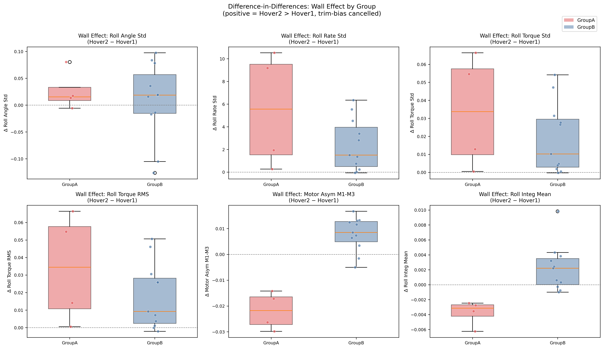

**壁効果の大きさだけでなく、方向が機体構成で反転** (d = 4.21, p = 0.001)

---

## ベンチ計測との整合

| 観点 | ベンチ計測 (6 軸力センサ) | フライトログ (制御応答) |
|---|---|---|
| 壁効果の検出 | モーメント増大 | Roll Rate/Torque 増大 (p < 0.01) |
| 変形による抑制 | peak-to-peak 最大 90% 低減 | Torque RMS: Group B が A の 1/3 |
| 応答の質的変化 | モーメント符号の変化 | Motor Asym の方向反転 (d = 4.21) |
| 定常外乱 | — | Roll Integ の蓄積方向が反転 |

→ ベンチ計測の知見が **制御系レベルでも再現**

---

## まとめ

### 実証されたこと
1. **制御ログから壁効果を検出可能** — Roll Rate / Torque / Motor Asym が有意に変化
2. **壁効果応答が機体構成で質的に異なる** — Motor Asym の方向反転 (d = 4.21)
3. **ベンチ計測との整合** — Torque RMS が Group B で Group A の約 1/3

### 限界
- ベンチ固定 (並進自由度なし) → 自由飛行検証が必要
- Group A/B の機体構成対応は推定 (確定記録なし)
- Group A は n = 4 → 統計的検出力に限界
